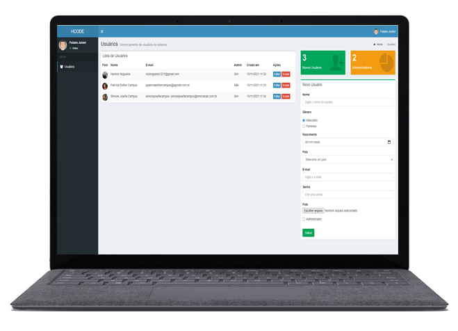
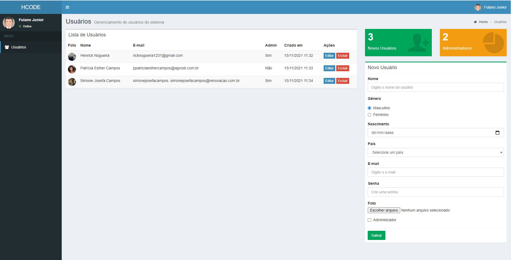

<h1 align="center">
   
</h1>

<h4 align="center"> 
	🚧 Gerenciamento de Usuários - Front-End 🚀 Concluido...  🚧
</h4>

## ✅ Funções

- [x] Criar
- [x] Atualizar
- [x] Deletar
- [x] Listar

## 🛠 Tecnologias

As seguintes ferramentas foram usadas na construção do projeto:

-  [JavaScript](https://developer.mozilla.org/pt-BR/docs/Web/JavaScript)
-  [HTML5](https://developer.mozilla.org/pt-BR/docs/Web/HTML)

## 🖥️ Plataforma adotada

  - WEB

## 📸 Screenshot

	

